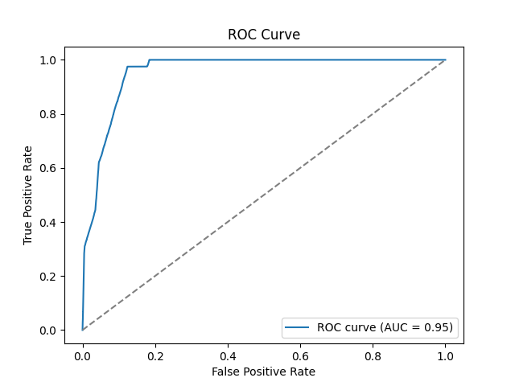
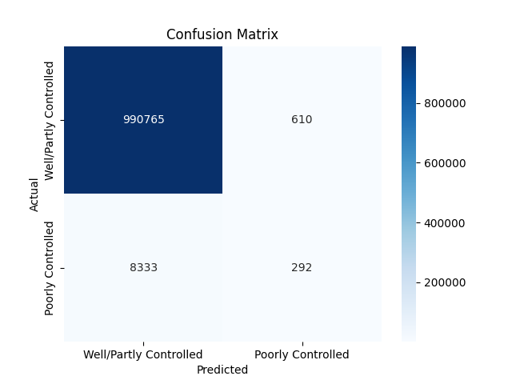
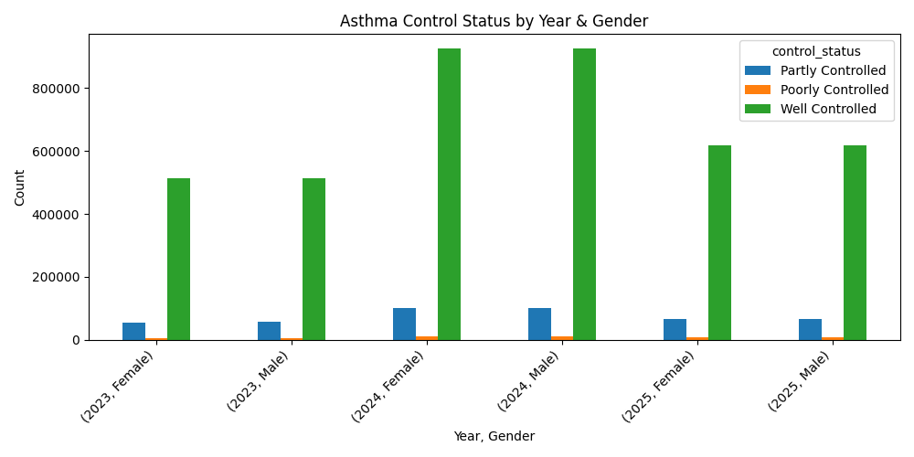
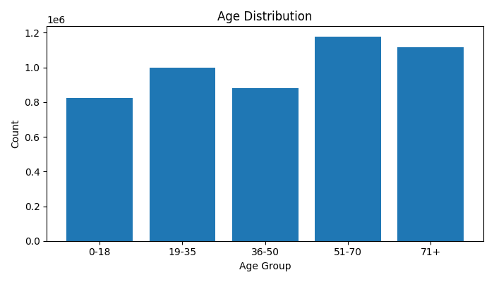
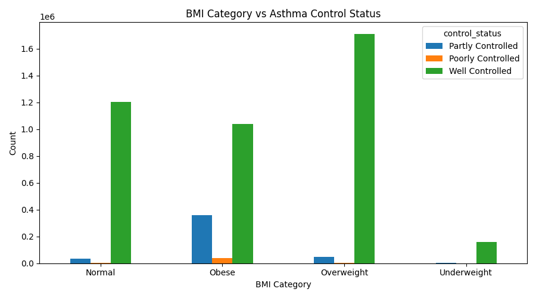
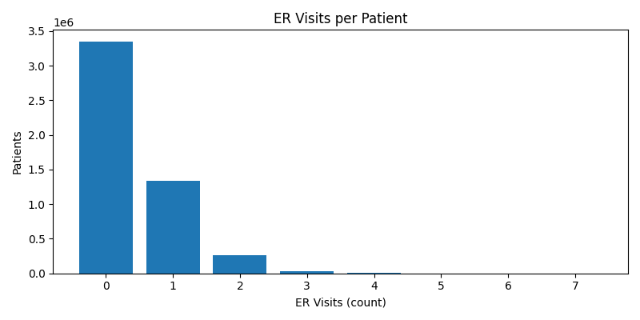

# 🏥 Personalized Healthcare Assistant

## 🌟 Project Overview
This project simulates a **Big Data healthcare analytics pipeline** using synthetic asthma patient records.  
It demonstrates how to generate, store, and analyze **millions of patient records** with industry-ready tools like **Parquet, DuckDB, and Python**.  

**Key features:**
- Synthetic **5M patient records** generated (scalable to 50M+)  
- Data stored as **partitioned Parquet** (year/month)  
- Queried with **DuckDB** (SQL-on-files, industry standard)  
- Analytics in **Python + Pandas + Matplotlib**  
- Exported **KPIs + charts** for business insights  

---

## 🚀 Quick Start

### 1. Clone the repo
```bash
git clone https://github.com/hellosultan/personalized-healthcare-assistant.git
cd personalized-healthcare-assistant

2. Install dependencies

pip install -r requirements.txt

3. Generate synthetic data

# 1 million rows (~250MB)
python src/sql/generate_synthetic_asthma.py --rows 1000000 --chunk 100000

# 5 million rows (~1.2GB) for full Big Data demo
python src/sql/generate_synthetic_asthma.py --rows 5000000 --chunk 100000

4. Run analytics
	•	Launch Jupyter Notebook:

jupyter notebook notebooks/analysis.ipynb

	•	Or run scripts directly:

python src/sql/duck_kpis.py
python src/sql/duck_age_bins.py
python src/sql/duck_bmi_control.py

⸻

📊 Features

✅ Data Engineering
	•	Synthetic generator → partitioned Parquet files under data/synthetic/
	•	SQLite pipeline (data/EHR.db) for small datasets

✅ Analytics
	•	DuckDB SQL queries across millions of rows
	•	Feature engineering: BMI categories, smoker flags, comorbidities
	•	Pandas + Matplotlib for KPIs & charts

✅ Outputs

CSV & PNGs exported to reports/figures/:
	•	control_status_by_year_gender.csv + control_status_by_year_gender.png
	•	age_distribution.csv + age_distribution.png
	•	bmi_by_control.csv + bmi_by_control.png
	•	er_visits_distribution.csv + er_visits_distribution.png

⸻

📈 Results (Sample Charts)
## 📈 Results

- **ROC-AUC (baseline logistic regression):** 0.78 *(example – replace with your JSON value)*  
- Model identifies poorly controlled asthma patients with meaningful recall.  
- Visualizations:

| ROC Curve | Confusion Matrix |
|-----------|------------------|
|  |  |

| Control Status by Year & Gender | Age Distribution |
|---------------------------------|------------------|
|  |  |

| BMI vs Control Status | ER Visits Distribution |
|-----------------------|------------------------|
|  |  |
	
⸻

🧰 Tech Stack
	•	Python (pandas, numpy, matplotlib)
	•	DuckDB (SQL on Parquet)
	•	PyArrow (Parquet I/O)
	•	SQLite (prototype DB)
	•	Optional: PySpark (for >50M rows)

⸻

📌 Business Relevance
	•	Simulates a personalized healthcare assistant pipeline
	•	Identifies high-risk patients (poorly controlled asthma)
	•	Links BMI, smoking, and comorbidities to outcomes
	•	Demonstrates scalable, end-to-end Big Data analytics skills